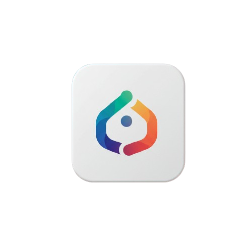

<div align="center">
  
  <h1>🤖 Dipta AI - Modern Intelligent Chatbot</h1>
  <p><strong>Aplikasi Web Chatbot Cerdas dengan Antarmuka Modern Terinspirasi dari Google Gemini, Claude, dan ChatGPT</strong></p>

  <p>
    
    
    
    
  </p>
</div>

---

## 🌟 Tentang Proyek

**Dipta AI** adalah proyek eksperimen / proyek iseng saya untuk memperdalam pemahaman mengenai integrasi Third-Party API (khususnya **Groq Cloud AI**) dan pembuatan website sederhana menggunakan **PHP Native** dan **MySQL**.

Melalui proyek ini, saya bereksperimen dalam menghubungkan antarmuka web dengan Large Language Model (LLM), mengelola riwayat percakapan (*context memory*), menangani komunikasi asynchronous (AJAX), hingga merancang antarmuka gelap (*dark mode*) yang bersih dan nyaman terinspirasi dari platform AI modern seperti Google Gemini, Claude, dan ChatGPT.

---

## ✨ Fitur Utama

- 🎨 **Antarmuka Modern (Gemini, Claude & ChatGPT Style)**:
  - Tema gelap (*dark mode*) mewah dengan *ambient glow* dan aksen gradasi halus.
  - **Hero Welcome State**: Tampilan sapaan interaktif di awal obrolan lengkap dengan **4 Kartu Rekomendasi Prompt (Suggestion Cards)**.
  - **Floating Prompt Dock**: Kolom input melayang dengan textarea auto-grow, badge model AI, dan tombol kirim SVG dinamis.
- 🧠 **Context Memory (Ingatan Obrolan)**:
  - Bot mengingat hingga **10 riwayat percakapan sebelumnya** dalam room yang sama, memungkinkan percakapan yang koheren dan berkelanjutan (*multi-turn conversation*).
- 📝 **Markdown & Code Syntax Highlighting**:
  - Format teks otomatis (teks tebal, miring, daftar list, tabel, blockquote) menggunakan **Marked.js**.
  - Blok kode pemrograman dengan tema gelap (*GitHub Dark*) menggunakan **Highlight.js** dan dilengkapi tombol **"Salin Kode"** (*Copy to Clipboard*).
- 🗑️ **Modal Hapus Obrolan Kustom di Tengah Layar**:
  - Dialog konfirmasi hapus bergaya *Glassmorphism* dengan *backdrop blur*, ikon tempat sampah bernuansa merah, serta dukungan tombol **`Escape` (ESC)** dan klik di luar area modal untuk membatalkan.
- 🏷️ **Auto-Rename Judul Room**:
  - Judul room default (*"Obrolan Baru"*) otomatis diperbarui menjadi topik pertanyaan pertama yang diajukan pengguna secara real-time.
- 🔒 **Keamanan & Performa Tinggi**:
  - Kebal terhadap SQL Injection berkat penggunaan **Prepared Statements** (`mysqli::prepare`) di seluruh operasi database.
  - Proteksi XSS (Cross-Site Scripting) pada perenderan pesan pengguna.
  - Dukungan penuh karakter multibyte dan emoji (`utf8mb4_unicode_ci`).

---

## 🛠️ Tech Stack

| Komponen | Teknologi |
| :--- | :--- |
| **Backend** | PHP 8.0+ (Native Procedural & cURL) |
| **Database** | MySQL / MariaDB (Engine InnoDB, Charset `utf8mb4`) |
| **Frontend** | Vanilla HTML5, CSS3 Variables, Modern JavaScript (Fetch API) |
| **AI Provider** | Groq Cloud API (`openai/gpt-oss-120b` / `llama-3.3-70b-versatile`) |
| **Libraries** | [Marked.js](https://marked.js.org/), [Highlight.js](https://highlightjs.org/), Google Fonts (*Plus Jakarta Sans* & *Fira Code*) |

---

## 📁 Struktur Repositori

```text
├── asset/
│   ├── favicon.png         # Ikon favicon browser
│   └── logo.png            # Logo resmi aplikasi Dipta AI
├── config.example.php      # Template konfigurasi database & API Key
├── config.php              # Konfigurasi aktif (database & Groq API)
├── database.sql            # Skema tabel database MySQL (rooms & chat)
├── groq.php                # Helper integrasi Groq AI API dengan chat memory
├── index.php               # Halaman utama aplikasi (View & Controller)
├── chat-ajax.php           # Endpoint asynchronous untuk pengiriman pesan chat
├── style.css               # Stylesheet lengkap antarmuka dark mode
├── .gitignore              # Daftar file yang diabaikan oleh Git
└── README.md               # Dokumentasi proyek
```

---

## 🚀 Panduan Instalasi Lokal

Ikuti langkah-langkah berikut untuk menjalankan Dipta AI di komputer lokal Anda (menggunakan **Laragon**, **XAMPP**, atau web server lainnya):

### 1. Clone Repositori
```bash
git clone https://github.com/username-anda/dipta-ai.git
cd dipta-ai
```
*(Atau tempatkan folder proyek ke dalam direktori web server Anda, misalnya `C:\laragon\www\baru` atau `C:\xampp\htdocs\dipta-ai`)*.

### 2. Import Database MySQL
1. Buka **phpMyAdmin** atau MySQL CLI Anda (`localhost/phpmyadmin`).
2. Buat database baru bernama `chatapp`.
3. Import file `database.sql` ke dalam database `chatapp`:
   ```bash
   mysql -u root -p chatapp < database.sql
   ```

### 3. Konfigurasi Kredensial & API Key
1. Buka file `config.php` (atau salin dari `config.example.php`):
   ```bash
   cp config.example.php config.php
   ```
2. Sesuaikan konfigurasi database Anda:
   ```php
   define('DB_HOST', 'localhost');
   define('DB_USER', 'root');
   define('DB_PASS', '');       // Kosongkan jika menggunakan XAMPP default, atau 'root' untuk Laragon
   define('DB_NAME', 'chatapp');
   ```
3. Dapatkan **API Key Groq gratis** di [console.groq.com/keys](https://console.groq.com/keys), lalu masukkan ke:
   ```php
   define('GROQ_API_KEY', 'gsk_xxxxxxxxxxxxxxxxxxxxxxxxxxxx');
   ```

### 4. Buka Aplikasi di Browser
Buka browser favorit Anda dan akses:
```
http://localhost/baru/
```
*(Sesuaikan nama folder dengan lokasi proyek Anda)*.

---

## 🛡️ Praktik Keamanan yang Diterapkan

1. **Prepared Statements**: Seluruh masukan pengguna di-*bind* menggunakan parameterized query `$stmt->bind_param(...)` untuk mengeliminasi risiko injeksi SQL.
2. **Sanitasi DOM**: Teks pesan pengguna diproses secara aman menggunakan `textContent` sebelum masuk ke DOM untuk mencegah eksekusi skrip berbahaya (XSS).
3. **Penyimpanan UTF8MB4**: Database dan kolom teks dikonfigurasi dengan `utf8mb4` agar karakter internasional dan emoji tersimpan tanpa menyebabkan *database exception*.

---

## 📄 Lisensi & Kontribusi

Proyek ini dibuat untuk keperluan pengembangan dan pembelajaran open-source di bawah lisensi [MIT License](LICENSE).

Kontribusi, kritik, dan saran pengembangan selalu terbuka melalui *Pull Request* atau *Issues*.

---

<div align="center">
  Dibuat dengan ❤️ oleh <strong>Muhammad Rafli Pradipta</strong>
</div>
