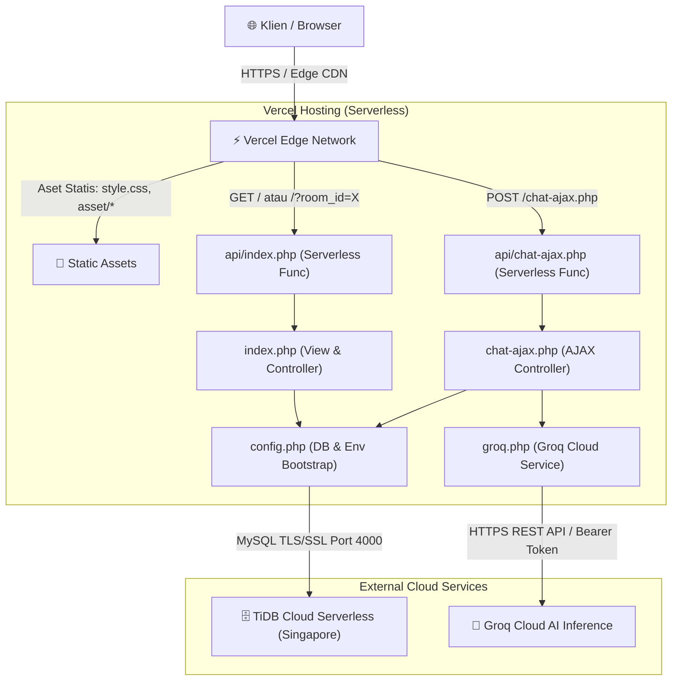

# 🤖 Dipta AI — Comprehensive Project & Architecture Documentation
> **Notion Import Ready**: Dokumen ini dirancang dengan standar hierarki dan format blok Notion (Callouts, Properties Table, Toggles, Code Blocks, dan Mermaid Diagrams). Dapat langsung di-import atau di-copy-paste ke workspace Notion Anda.

---

## 📌 Project Overview & Properties

| Properti | Nilai |
|---|---|
| **Nama Proyek** | Dipta AI Chatbot |
| **Status** | 🟢 `Live in Production` |
| **Versi** | `v1.2.0-secure-serverless` |
| **Author / Lead** | Muhammad Rafli Pradipta |
| **Live Production URL** | [chatbot-dipta-smoky.vercel.app](https://chatbot-dipta-smoky.vercel.app) |
| **GitHub Repository** | [github.com/Diptaaaa/Chatbot-Dipta](https://github.com/Diptaaaa/Chatbot-Dipta) |
| **Frontend Stack** | HTML5, Vanilla CSS3 (Custom Properties), Modern Vanilla JS (Fetch API, Marked.js, DOMPurify, Highlight.js) |
| **Backend Stack** | PHP 8.2+ / 8.5+ (Serverless Runtime `vercel-php@0.9.0` & Local Native Procedural) |
| **Database** | MySQL / MariaDB (Local) & **TiDB Cloud Serverless** (Production ap-southeast-1, TLS/SSL) |
| **AI Inference Engine** | **Groq Cloud API** (`openai/gpt-oss-120b` / `llama-3.3-70b-versatile`) |
| **Hosting Platform** | **Vercel** (Global Edge CDN + Serverless Functions) |
| **Biaya Operasional** | **Rp 0,- (100% Gratis Selamanya)** |

> [!NOTE]
> **Deskripsi Singkat**: Dipta AI adalah asisten virtual berbasis kecerdasan buatan (LLM) dengan antarmuka web modern bergaya dark-mode (*inspired by ChatGPT & Claude*), mendukung penyimpanan percakapan berbasis room multi-sesi, context memory riwayat obrolan, dan inferensi secepat kilat melalui Groq Cloud API.

---

## 🏛️ System Architecture

Arsitektur aplikasi terbagi menjadi tiga lapisan utama: **Edge Presentation**, **Serverless Compute**, dan **Cloud Data & AI**.



---

## 📁 Struktur Direktori & Peran File

```text
c:\laragon\www\baru/
├── 📁 .agents/             # Konfigurasi agen AI, workflows, dan skill ECC
├── 📁 .gemini/             # Konfigurasi Gemini IDE & standar proyek GEMINI.md
├── 📁 api/                 # Entry point Serverless Functions untuk Vercel
│   ├── chat-ajax.php       # Wrapper serverless untuk endpoint kirim pesan
│   └── index.php           # Wrapper serverless untuk routing halaman utama
├── 📁 asset/               # Aset gambar publik
│   ├── favicon.png         # Ikon tab browser (32x32)
│   └── logo.png            # Logo resmi aplikasi Dipta AI
├── 📁 docs/                # Dokumentasi arsitektur dan Notion
│   └── NOTION_PROJECT_DOCS.md # Dokumen Notion komprehensif ini
├── .env                    # Kredensial lokal (TIDAK di-commit / masuk .gitignore)
├── .gitignore              # Daftar file yang dikecualikan dari Git version control
├── chat-ajax.php           # Controller pemrosesan chat, context memory, & AI bridge
├── config.example.php      # Contoh template konfigurasi untuk developer baru
├── config.php              # Bootstrap database (Local/TiDB SSL) & Environment Variables
├── database.sql            # Skema DDL tabel MySQL (rooms & chat CASCADE)
├── groq.php                # Service client Groq Cloud API (cURL dengan SSL terenkripsi)
├── index.php               # Halaman utama aplikasi (View & Controller SSR)
├── README.md               # Dokumentasi pengenalan proyek GitHub
├── style.css               # Desain antarmuka responsif dark mode penuh (~1000 baris)
└── vercel.json             # Konfigurasi runtime vercel-php & routing aset statis
```

---

## 🛡️ Matriks Keamanan & Standar Kepatuhan ECC (OWASP Top 10)

Seluruh layer controller telah diaudit dan diperbaiki sesuai standar **ECC Code Review & Security Gate**:

| Kerentanan | Tingkat Risiko | Status | Mekanisme Pertahanan (*Mitigation Defense*) |
|---|:---:|:---:|---|
| **CWE-798: Hardcoded Secrets** | 🔴 CRITICAL | ✅ Resolved | Seluruh token Groq API dan password database dipindahkan ke .env untuk lokal dan Environment Variables di Vercel. Tidak ada secret di Git history. |
| **CWE-295: Insecure TLS/SSL** | 🔴 CRITICAL | ✅ Resolved | `CURLOPT_SSL_VERIFYPEER` dan `CURLOPT_SSL_VERIFYHOST` diaktifkan penuh pada komunikasi ke Groq API dan TiDB Cloud. |
| **CWE-352: CSRF via GET** | 🔴 CRITICAL | ✅ Resolved | Aksi hapus room diubah menjadi **HTTP POST**. Menggunakan pola **Double Submit Cookie** (`dipta_csrf`) yang stateless dan tahan terhadap arsitektur serverless. |
| **CWE-79: Stored / DOM XSS** | 🔴 CRITICAL | ✅ Resolved | Pustaka **DOMPurify 3.0.9** diintegrasikan untuk membersihkan seluruh tag berbahaya (`<script>`, ``) dari output `marked.parse()`. |
| **CWE-209: Information Leak** | 🟠 HIGH | ✅ Resolved | `$conn->error` dan stack trace dihapus dari respon JSON publik. Error dicatat secara aman via `error_log()`. `display_errors` dinonaktifkan di output HTTP. |
| **CWE-639: IDOR / Room Validation** | 🟠 HIGH | ✅ Resolved | Validasi eksplisit keberadaan `room_id` sebelum memanggil AI, mencegah kebocoran kuota atau orphaned chat rows. |
| **CWE-400: Resource Flooding** | 🟡 MEDIUM | ✅ Resolved | Input pesan dibatasi maksimal 4.000 karakter (`mb_strlen`). cURL timeout dibatasi 9 detik agar sesuai limit Vercel (10 detik). |
| **CWE-693: Missing Headers** | 🟡 MEDIUM | ✅ Resolved | Header `X-Frame-Options: SAMEORIGIN` (anti-Clickjacking) dan `X-Content-Type-Options: nosniff` aktif di setiap respon HTTP. |

---

## 🗄️ Kamus Data Database (Data Dictionary)

Database berjalan pada engine **InnoDB** dengan collation `utf8mb4_unicode_ci` (mendukung penuh emoji dan teks internasional).

### 1. Tabel `rooms` (Daftar Ruang Obrolan)
| Kolom | Tipe Data | Keterangan |
|---|---|---|
| `id` | `INT AUTO_INCREMENT PRIMARY KEY` | ID unik untuk setiap sesi ruang obrolan. |
| `judul` | `VARCHAR(255) NOT NULL` | Judul sesi percakapan. Otomatis diperbarui dari potongan pesan pertama pengguna. |

### 2. Tabel `chat` (Riwayat Pesan)
| Kolom | Tipe Data | Keterangan |
|---|---|---|
| `id` | `INT AUTO_INCREMENT PRIMARY KEY` | ID unik tiap baris pesan. |
| `sender` | `VARCHAR(50) NOT NULL` | Pengirim pesan: `'user'` atau `'bot'`. |
| `text` | `TEXT NOT NULL` | Isi konten pesan (mendukung sintaks Markdown dan kode). |
| `room_id` | `INT NOT NULL` | Foreign key mengarah ke `rooms(id)` dengan relasi `ON DELETE CASCADE`. |

---

## 🔌 Spesifikasi API Endpoint

### 1. `POST /chat-ajax.php`
Endpoint pengiriman pesan percakapan utama (Asynchronous AJAX).

* **Headers Wajib**:
  * `Content-Type: application/x-www-form-urlencoded` atau `multipart/form-data`
  * `X-CSRF-TOKEN: <token_dipta_csrf>`
* **Body Request**:
  * `pesan`: (string, 1 - 4000 karakter, wajib)
  * `room_id`: (integer, ID room aktif, wajib)
  * `csrf_token`: (string, fallback token CSRF)
* **Response Sukses (HTTP 200)**:
  ```json
  {
    "success": true,
    "reply": "Halo! Ada yang bisa saya bantu hari ini?",
    "new_title": "Jelaskan konsep machine learni..."
  }
  ```
* **Response Error**:
  * `HTTP 400`: Pesan kosong atau melebihi 4000 karakter.
  * `HTTP 403`: Token CSRF tidak valid atau sesi kedaluwarsa.
  * `HTTP 404`: Room tidak ditemukan di database.
  * `HTTP 405`: Metode request selain POST.
  * `HTTP 502`: Gangguan komunikasi dengan Groq Cloud AI.

---

### 2. `GET /` & `GET /?room_id={id}`
Merender tampilan UI lengkap beserta daftar riwayat obrolan dari room yang dipilih.

* **Query Params**:
  * `room_id` (opsional): ID room yang ingin ditampilkan. Jika kosong, default ke room terbaru.
  * `new=1` (opsional): Shortcut untuk membuat obrolan baru.

### 3. `POST /index.php`
Endpoint aksi form (Hapus room dan Buat room manual).

* **Aksi Hapus**: `action=hapus_room&hapus_id={id}&csrf_token={token}`
* **Aksi Tambah**: `judul_room={judul}&csrf_token={token}`

---

## 🚀 Panduan Deployment & Environment Runbook

### Matriks Environment Variables
Pastikan variabel lingkungan berikut terpasang di Vercel Dashboard (*Project Settings -> Environment Variables*):

| Variabel | Wajib | Contoh Nilai | Deskripsi |
|---|:---:|---|---|
| `DB_HOST` | Ya | `gateway01.ap-southeast-1.prod.aws.tidbcloud.com` | Host endpoint publik TiDB Cloud |
| `DB_PORT` | Ya | `4000` | Port koneksi TiDB Cloud MySQL |
| `DB_USER` | Ya | `4YjfZjEnWqRuE6f.root` | Username database TiDB |
| `DB_PASS` | Ya | `oUu5KXA9VyIbHDgE` | Password database TiDB |
| `DB_NAME` | Ya | `chatapp` | Nama database aktif |
| `GROQ_API_KEY` | Ya | `gsk_xxxxxxxxxxxxxxxxxxxxxxxx` | API key aktif dari Groq Console |
| `GROQ_MODEL` | Tidak | `openai/gpt-oss-120b` | Model AI aktif (default: 120B / Llama 3.3) |

---

## 🧪 Verification & Quality Scorecard

Hasil audit eksekusi otomatis (*Verification Loop*) pada tanggal 27 September 2026:

| Item Verifikasi | Hasil | Detail Pemeriksaan |
|---|:---:|---|
| **PHP Syntax Check** | 🟢 **PASS** | 7/7 file lolos tanpa error sintaks (`php -l`). |
| **Secret Scan (Git)** | 🟢 **PASS** | 0 secret bocor di repository Git (`git grep -i gsk_`). |
| **Database Connection** | 🟢 **PASS** | Terkoneksi sukses ke TiDB v8.5.3 dengan SSL terenkripsi. |
| **CSRF Defense Test** | 🟢 **PASS** | Request tanpa token ditolak `HTTP 403 Forbidden`. |
| **IDOR Defense Test** | 🟢 **PASS** | Request room palsu ditolak `HTTP 404 Not Found`. |
| **XSS Sanitization** | 🟢 **PASS** | Skrip jahat dinetralkan oleh DOMPurify di sisi browser. |
| **Live Web Health** | 🟢 **PASS** | `https://chatbot-dipta-smoky.vercel.app/` merespons `HTTP 200 OK`. |
| **Overall Status** | ✅ **READY** | Layak untuk produksi dan memenuhi seluruh kriteria mutu ECC. |

---

*Dokumen ini diperbarui secara otomatis dan disinkronkan dengan basis kode aktif repositori Dipta AI Chatbot.*
